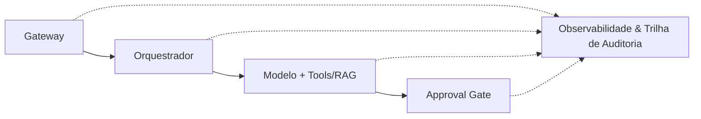
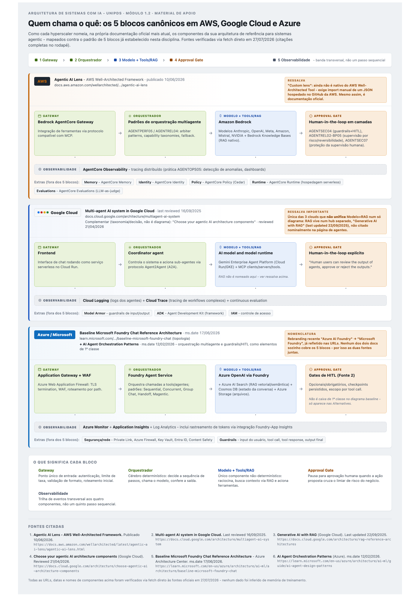

# Canvas: Diagrama de Referência AI-First
> **Ahirton Lopes · AI Architecture Toolkit**
> **Artefato de Demo - Módulo 1.2**

Use este canvas para desenhar a primeira versão da arquitetura do seu próprio caso. Ele é o mesmo diagrama usado no TrialForge: quatro componentes em sequência mais uma banda transversal de Observabilidade. A estrutura não muda, o conteúdo de cada caixa muda.

## Diagrama (Mermaid)

> Renderize este bloco num visualizador compatível com Mermaid (VS Code com a extensão de preview, Obsidian, Typora, GitHub, ou cole em claude.ai) para ver o diagrama desenhado, não o código.

## Referência: TrialForge (Vitalis Pharma)

| Componente | O que é (definição genérica) | Função no TrialForge |
|---|---|---|
| **Gateway** | Ponto único de entrada: autenticação, limite de taxa, validação de formato, roteamento inicial | Autentica a submissão do protocolo, valida formato |
| **Orquestrador** | Cérebro determinístico: decide a sequência de passos, chama o modelo, confere a saída | Reconhece a tarefa ("gerar ICF"), decide o contexto a enviar ao modelo |
| **Modelo + Tools/RAG** | Único componente não-determinístico do diagrama: o modelo raciocina, busca contexto via RAG e aciona ferramentas | Busca cláusulas regulatórias padrão via RAG, gera o rascunho |
| **Approval Gate** | Pausa para aprovação humana quando a ação proposta cruza o limiar de risco definido pelo dono do negócio | Especialista regulatório revisa e aprova antes da versão oficial |
| **Observabilidade** | Trilha de eventos transversal aos quatro componentes, não um quinto passo sequencial | Registra versão do prompt, tempo de resposta, e se houve edição humana |

## Seu caso: preencha os quatro componentes e a banda de observabilidade

(A Observabilidade é transversal aos outros quatro, não um quinto passo sequencial, mas vale mapear separadamente na tabela abaixo.)

| Componente | O que ele faz no seu contexto | Já existe hoje? |
|---|---|---|
| **Gateway** | | Sim / Não / Parcial |
| **Orquestrador** | | Sim / Não / Parcial |
| **Modelo + Tools/RAG** | | Sim / Não / Parcial |
| **Approval Gate** | | Sim / Não / Parcial |
| **Observabilidade** | | Sim / Não / Parcial |

## Perguntas-guia

1. Qual componente já existe no seu sistema atual, mesmo que ninguém o chame por esse nome? (Gateway e Observabilidade costumam já existir em algum grau.)
2. Qual componente é o mais arriscado de não ter? Normalmente é o Approval Gate ou a Observabilidade, não o Modelo em si.
3. Onde fica o limiar de risco que aciona o Approval Gate no seu caso, e quem, do lado do negócio, deveria decidir esse limiar, não só a engenharia?

Guarde este canvas: ele volta a ser referenciado a partir do Módulo 2, quando cada componente ganha profundidade técnica própria.

## Cheat sheet: como cada cloud nomeia os 5 blocos

AWS, Google Cloud e Azure não usam os mesmos nomes do canvas acima, mas cada um tem hoje uma arquitetura de referência oficial que mapeia quase 1:1 para os mesmos 5 blocos. A imagem abaixo compara os três lado a lado (fontes verificadas via fetch direto em 27/07/2026):

**Versão para entregar aos alunos:** `cheat-sheet-arquiteturas-referencia-clouds.pdf` (mesma pasta) - PDF de página única, texto vetorial em alta resolução, pronto para distribuir como artefato do módulo.

Versão interativa (tema claro/escuro, links clicáveis): https://claude.ai/code/artifact/0fd59f5b-d5ee-4eea-ab1d-da9d95769956

| Provider | Fonte oficial mais atual | Data | Ressalva principal |
|---|---|---|---|
| **AWS** | Agentic AI Lens (AWS Well-Architected) | Publicado 10/06/2026 | É um "custom lens": ainda não nativo do Well-Architected Tool, exige import manual via GitHub |
| **Google Cloud** | Multi-agent AI system in Google Cloud | Last reviewed 16/09/2025 | Única das 3 que não unifica Modelo+RAG: RAG vive num hub separado ("Generative AI with RAG") |
| **Azure/Microsoft** | Baseline Microsoft Foundry Chat Reference Architecture + AI Agent Orchestration Patterns | ms.date 17/06/2026 e 12/02/2026 | Nenhum dos dois docs sozinho cobre os 5 blocos - Approval Gate só é 1ª classe no segundo |

Os links completos das seis fontes (3 principais + 3 complementares) estão no rodapé da imagem e também no documento de indicações de leitura da disciplina.

---

*Ahirton Lopes · AI Architecture Toolkit, UNIPDS: Arquitetura de Sistemas com IA*
*Prof. Ahirton Lopes, Ph.D., GDE AI, Microsoft MVP, Senior Manager*
